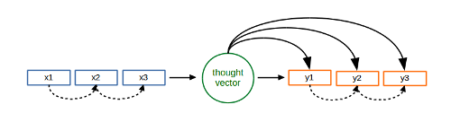

# lasange seq2seq
An attempt to implement Sequence to sequence architecture on Lasagne. Since it doesn't produce awesome results so far, also consider other implementations of [seq2seq](https://github.com/nicolas-ivanov/nn_chatbot_links).

The code includes:

* small dataset of movie scripts to train your models on
* preprocessor function to properly tokenize the data
* word2vec helpers to make use of gensim word2vec lib for extra flexibility
* implementation of two seq2seq architectures
* train and predict function to harness the power of seq2seq
 
**Warning**

* See the results section to get an idea of the results that you can get with the implemented architectures.

**Setup&Run**

    git clone https://github.com/nicolas-ivanov/lasagne_seq2seq.git
    cd lasagne_seq2seq
    bash bin/setup.sh
    python bin/train.py

and then

    python bin/test.py
     
    
## Seq2seq v1

(without feeding)

Results:

    what do you think about bill gates ?         →  you ' re not a little man , baby . .
    what happens if machines can think ?         →  i ' m going to be a lot of your wife
    what is the greatest novel every written ?   →  what are you doing ?
    have you hurt anyone ?                       →  i can ' t believe it .
    is madrid the capital of portugal ?          →  you ' re not going to be the old !
    what is the meaning of life ?                →  you ' re not a good .
    my name is david. what is my name?           →  well , i ' m not sure . i ' m
    my name is john. what is my name ?	         →  you ' re going to get out .
    what is the purpose of being intelligent?	 →  i don ' t have .
    is the sky blue or black ?	                 →  it ' s a little ### .
    what is love?	                             →  i ' m sorry .
    what do you think about tesla ?	             →  i ' m so what you ' re going to know
    what do you think about china?	             →  i don ' t know .

Params:

* 1 encoding lstm, 1 decoding lstm
* vocabulary sizee =  22k tokens
* hidden state dimensionality = 512
* sequence length = 15
* 2 days of training on Nvidia Grid K520

## Seq2seq v2

(with feeding)

Results:

    hi                      → i ? ? ___ ___ ___ ___ ___ ___
    hello                   → i , ? ___ ___ ___ ___ ___ ___
    how are you?            → what ?
    hey what's up?          → i a ? ___
    how come?               → i ?
    how old are you?        → and ? ? ___ ? ___ ___ ___ ?
    what is two plus two?   → i know ? ___ ___ ___ ___ ___ ___
    what is your name?      → and , ? ___ ___ ___ ___ ___
    bye, sweety             → i them okay ? ___ ___ ___ ___ ___

Params:

* the same as above
* 1 day of training on Nvidia Grid K520

## Why so sad?

Seq2seq architecture aims to solve the problems of limited contexts by encoding the whole input phrase to a “thought vector”. 
This approach seems to be reasonable but at the same time it makes conversational models hard to train. 
For example, in n-gram approach we map a sequence of tokens to a single token and the number of different tokens is relatively small (typically less than 100k).
In seq2seq model, however, we are trying to map a sequence to a thought vector and the number of different thoughts can be very large: 
if the max sequence length is capped by 10 and the vocabulary size is 100k, than the number of different "meanings" can be estimated by 100k^10 (i.e. 10^50). 
Of course, in reality different sentences can easily have almost the same meanings (“hi”, “hello”), 
but also one sentence can have different meanings in different contexts (due to words homonymy and usage of irony), 
so the number of different meanings is indeed big enough even for short sequences. 
In order to capture the meanings of the phrases one should have:
 
* a lot of training data with a significant number of examples of similar meanings (see \[[3]\])
* relatively large “though vectors” within a model (and thus large hidden states of lstm layers), Oriol Vinyals and Quoc Le in \[[2]\] paper used vectors with 4096 cells in their experiments
* a lot of computational power (i.e. many GPUs working in parallel, for example 8 were used in \[[1]\])
* a lot of time (more than a week) to train a big seq2seq model (10 days in \[[1]\])

Seq2seq architecture that feeds a thought vector to decoder on every step (seq2seq v2) failed to learn anything meaningful even on a syntactical level. 
The reason may be the following: in this architecture the encoder and decoder are trained simultaneously 
and at the beginning of the training process the encoder is generating bad noisy thought vectors and this noise is added during decoding phase to every correct token y_i thus making it significantly more difficult for lstm decoder to learn the proper language patterns.
In order to resolve this problem one may try to use a pre-trained encoder from seq2seq model without thoughts-feeding (i.e. from seq2seq v1)
For the same reason it might be better to use pre-trained word embeddings than trying to build them while learning the rest of the network’s weights.

**Papers**

[\[1\] Sequence to Sequence Learning with Neural Networks][1]
[\[2\] A Neural Conversational Model][2]
[\[3\] A Survey of Available Corpora For Building Data-Driven Dialogue Systems][3]

* [1]: http://papers.nips.cc/paper/5346-sequence-to-sequence-learning-with-neural-networks.pdf
* [2]: http://arxiv.org/pdf/1506.05869v1.pdf
* [3]: http://arxiv.org/pdf/1512.05742v2.pdf
